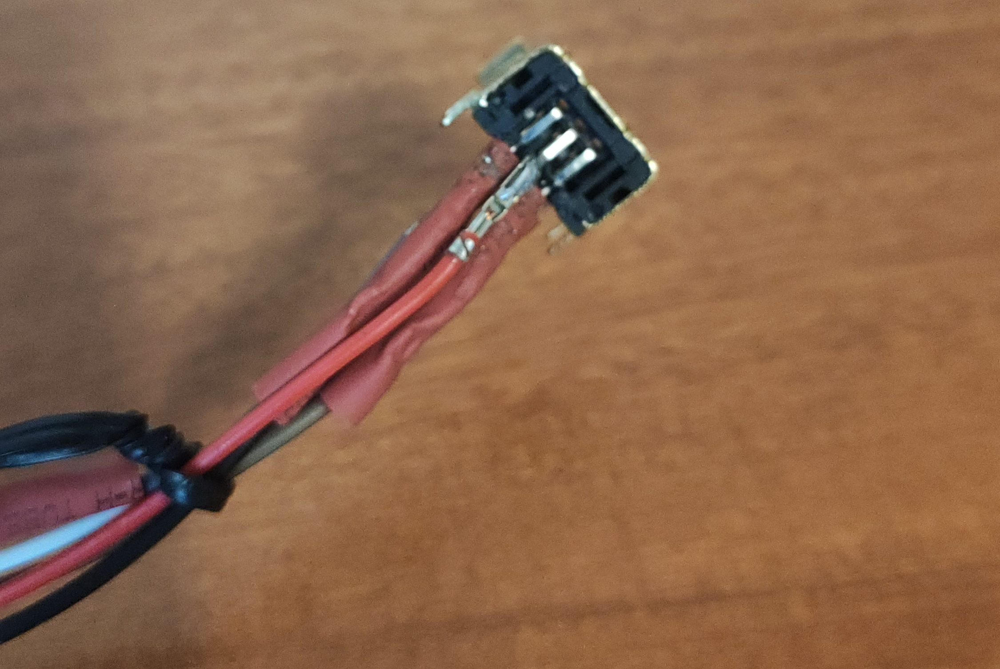
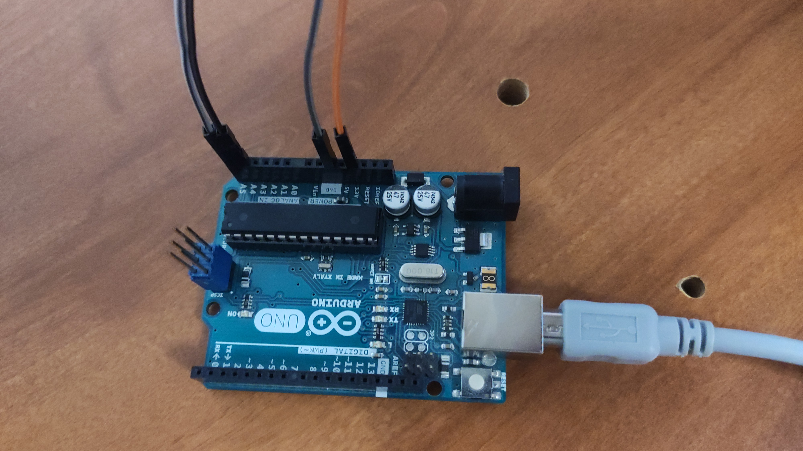
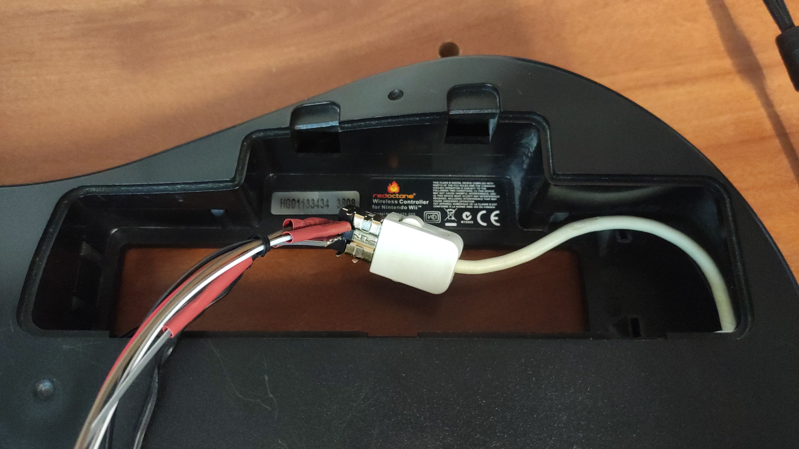

# Wii Guitar Hero adapter for Windows

This project connects an old Wii guitar using an Arduino Uno to a Windows computer.

## Warning
I am a complete beginner in C and as a result this code is written poorly using many code samples. A lot of things can be improved, but I wanted something working.

## Guitar to Arduino Uno connection

I bought a Dock Connector Port on [Aliexpress](https://www.aliexpress.com/item/32881749867.html?spm=a2g0s.12269583.0.0.723b21c1rGgTcC) because I don't want to spoil my guitar.
I tin solder the connector with some wire.

## The Arduino Uno

Then I connected the wires to the Arduino using the following picture. There are two 3.3v pins and only pin 3 is useful to detect the devices.

After that, I wrote the Arduino code using the [NintendoExtensionCtrl](https://github.com/dmadison/NintendoExtensionCtrl) lib and the example code.

## Handling data on the Computer

Finally, I connected to my guitar the Arduino and wrote a C program which read the serial COM port to get the guitar data and then send keyboard inputs to Windows.

## TODO

I want to remove the Arduino Uno and connect the guitar directly to the computer. 
